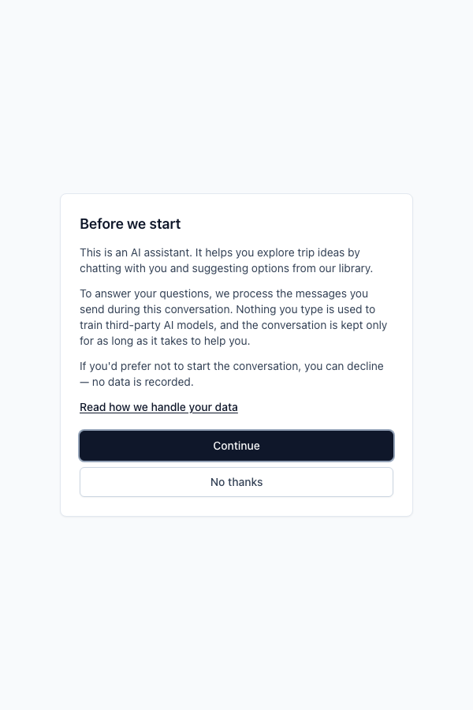
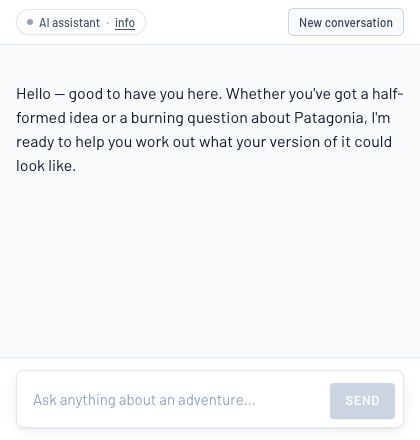
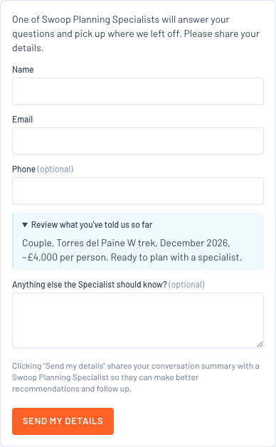

# Swoop Web Discovery Agent: Legal review pack

**Version**: 0.7
**Date**: 2026-06-16
**Audience**: Swoop (internal sense-check), then Swoop legal counsel
**Prepared by**: Alastair Brayne, WhaleyBear Ltd trading as Lope (al@lope.works)

---

## How to use this document

**Swoop Web Discovery Agent** is a conversational AI assistant on Swoop's Patagonia website, currently live in staging. Public launch requires sign-off from Swoop's legal counsel. This pack puts the outstanding decisions (§3) and visitor-facing copy (§4) in one place for review.

Two kinds of input are needed:

1. **Decisions** (§3). Counsel-only calls, choices Lope has made for counsel to confirm or amend, and operational selections Swoop owns. Each carries the *why*, *how*, and *what's required* inline.
2. **Copy edits** (§4). Every visitor-facing word has an **ID** and a draft. Counsel track-changes the **Draft** column; Lope applies edits against the IDs.

## How to return this document

1. Open this document in Microsoft Word (or Word-compatible software).
2. Enable **Track Changes** (Review → Track Changes).
3. For any copy to amend, edit the text in the **Draft** column. Leave the **ID** column untouched.
4. For any decision in §3 needing comment, add a Word comment against the decision heading or write inline.
5. Save with `_legal-review-<date>` appended to the filename.
6. Return to Alastair (al@lope.works) or the nominated Swoop contact.

## What happens next

1. Lope extracts the edits against each ID and applies them into the live surface. Mechanical work.
2. Consent-copy versions bump where consent-bearing copy changed. Audit trail per record.
3. Lope re-issues this document at the next version number reflecting the new state.
4. Where counsel raised a question on a §3 decision, Lope responds in writing (separate letter or inline in the next version) before applying.
5. Once §3 is resolved and §4 approved, counsel signs the final document and launch can proceed.

---

## Contents

1. [What the agent does](#1-what-the-agent-does)
2. [The visitor journey](#2-the-visitor-journey)
3. [Decisions needed from Swoop and counsel](#3-decisions-needed-from-swoop-and-counsel). §3.1 counsel-only (9), §3.2 confirm-or-amend (7), §3.3 Swoop operational (7).
4. [Copy table](#4-copy-table). Opening screen, chrome badge, privacy modal, lead-capture form, error states, handoff emails.
5. [Glossary and related artefacts](#5-glossary-and-related-artefacts)

---

# 1. What the agent does

The agent is an iframe embedded in the Patagonia website. A visitor opens the chat from a nav button and has a short, warmth-led conversation. Outcome is one of: a warm specialist handoff (with conversation context), a referral out (outside service scope), or a polite close.

The agent does **not** build itineraries, quote prices authoritatively, or book trips. Patagonia is the launch scope; later releases extend to other destinations.

### Personal data the agent touches

- **From conversation start** (tier-1 consent): free-form visitor messages (may contain PII at visitor's discretion) plus session metadata (id, timestamps, turn count).
- **From handoff submission** (tier-2 consent): visitor name, email, optional phone, preferred contact method, optional marketing opt-in.
- **Derived**: a structured triage verdict (`qualified` / `referred_out` / `disqualified` / `inconclusive`), reason code, agent's free-text summary, a wishlist of trips and regions.
- **Not collected**: no third-party analytics in the chat surface, no fingerprinting, no payment data, no IP-address persistence beyond standard Google Cloud Logging (30-day default).

### Lawful basis

**GDPR Article 6(1)(a), explicit consent**, two-tier:

- **Tier 1** at conversation start, paired with EU AI Act Art. 50 AI disclosure. Without it, no session state is written.
- **Tier 2** inside the lead-capture form at handoff, separate from an optional marketing opt-in (unticked by default).

Legitimate-interest framing was considered and rejected. A chatbot that freely receives PII in messages reads cleaner under explicit consent.

### Jurisdictional posture

Swoop is UK-established, so **UK GDPR** applies. **EU GDPR** and **EU AI Act** (Art. 50, enforceable 2 August 2026) are also covered to a degree because UK law generally tracks EU privacy law. Other jurisdictions where Swoop sells or attracts visitors (US, Brazil, Canada, Australia, etc.) need equivalent treatment. See D-3.1.5.

---

# 2. The visitor journey

Six surfaces a visitor can see. Each maps to a section in §4.

### Surface 1. Opening screen (tier-1)

First visit, before any chat appears. Full-screen modal pairing AI disclosure with consent. Two buttons: *Continue* (proceeds) and *No thanks* (closes, nothing recorded). The server refuses chat requests from sessions without tier-1 consent.

{width=4in}

### Surface 2. Persistent chrome badge

Visible throughout the conversation. Small "AI assistant · info" tag at the top; clicking *info* opens the privacy modal. Cannot be dismissed.

{width=4in}

### Surface 3. Privacy info modal

Opened from the opening screen's privacy link or the chrome badge. Short modal with the longer "what happens with your data" copy. Closes via X, the Close button, Esc, or click-outside.

{width=4in}

### Surface 4. Conversation

Standard chat. Tool-call widgets (trip cards, hotel cards, region cards, customer stories) render inline. No new consent prompts at this stage. What the agent says is generated dynamically per visitor and isn't in the copy table; the underlying system prompt that shapes the agent's voice lives outside this pack (see §5).

### Surface 5. Lead-capture form (tier-2)

Renders inline when the agent converges on a verdict and triggers handoff. Name and email (required), phone and preferred method (optional), a free-text "anything else?" textarea, a collapsible disclosure showing what will be shared, a **required** tier-2 consent tickbox, and an **optional** marketing opt-in tickbox (unticked by default).

{width=4in}

On Submit, the server validates, enriches the payload from session state, writes the durable record, and (if email is enabled) sends a verdict-aware email. **Dual backstop**: both the server route and the underlying handoff side-effect refuse to write the record without both consent flags.

### Surface 6. Sales-facing handoff email

Sent to Swoop's sales inbox for `qualified` and `referred_out` verdicts. **No email** for `disqualified` or `inconclusive`. Those keep a 90-day durable record for analytics; sales isn't notified. Templates are in §4.6.

---

# 3. Decisions needed from Swoop and counsel

## 3.1 Counsel-only calls

### D-3.1.1. DPIA needed?

**Why**: GDPR Art. 35 requires a DPIA where processing is *"likely to result in a high risk"*.

**Our reading**: narrow processing scope, explicit-consent basis, no Art. 22 automated decision-making. None of the typical high-risk indicators apply.

**Required**: confirm or override. If a DPIA is required, it's a sibling deliverable to this pack.

---

### D-3.1.2. Article 22 framing

**Why**: Art. 22 protects against *solely automated decisions* with "legal effects" or "similarly significant effects".

**Our reading**: the agent's triage classifier categorises visitors (qualified, referred-out, disqualified, inconclusive) but this is a routing signal, not a binding decision. Sales follow-up is human-led; disqualified visitors aren't denied service in any binding sense (they can still browse the site and use existing contact forms). A specialist can revise the verdict after handoff.

**Required**: confirm Art. 22 doesn't apply, or instruct us to add a "human-review-before-consequence" surface.

---

### D-3.1.3. Retention windows defensibility

**Why**: GDPR Art. 5(1)(e) requires data to be kept no longer than necessary.

| Data | Retention | Lawful basis | Enforced in code? |
|---|---|---|---|
| In-progress session (idle) | 24 hours | Art. 5(1)(c)+(e) | **No**. Sessions live in-memory until orchestrator restart; sweeper not yet wired. |
| In-progress session (archived) | +7 days | as above | **No**. As above. |
| Handoff, qualified or referred-out | **360 days** outer bound (or until CRM ingestion, whichever sooner) | Art. 6(1)(a) consent plus sales lifecycle | **Yes**, in code; sweeper disabled by default in staging, flips on at launch. |
| Handoff, disqualified | **90 days** | Art. 6(1)(f) legitimate interest in product analytics | As above. |
| Handoff, inconclusive | **90 days** | Art. 6(1)(f) legitimate interest in product analytics | As above. |
| Tier-1 / tier-2 consent records | Lifetime of handoff | bundled with the handoff record (audit trail) | Yes. |
| Cloud Logging events | 30 days | Art. 6(1)(f) observability | Yes. Google Cloud native. |

**Notes**: the "or until CRM ingestion" branch isn't auto-enforced. It requires an operator-initiated deletion. The 360-day outer bound is the failsafe. "360 days" rather than "12 months" avoids calendar and leap-year edge cases; errs conservative under Art. 5(1)(e).

**Required**:

- Is the 90-day analytics retention for disqualified and inconclusive verdicts defensible under legitimate-interest balancing? No `contact` field is stored on those records.
- Is the 360-day outer bound right for qualified and referred-out? Swoop's actual sales-lead lifecycle is the ground truth.
- Is the 7-day Google Cloud SQL backup window for erasure-then-restore acceptable?
- Is unwired session-side enforcement acceptable at launch (sessions clear on orchestrator restart, which happens at least daily under Cloud Run lifecycle), or required before public traffic? See also D-3.1.9.

---

### D-3.1.4. Hard-delete posture

**Why**: when records expire, the sweeper hard-deletes them from the store.

**Our reading**: hard-delete is the cleanest mechanic for Art. 5(1)(e) and aligns with visitor expectation that expired records are gone. Deletion signals are auditable via the observability event stream (counts only, no PII).

**Alternative**: soft-delete to a quarantine area with a secondary window. One-line implementation change; interface and runbook unchanged.

**Required**: confirm hard-delete, or instruct soft-delete and name the secondary window.

---

### D-3.1.5. Coverage of jurisdictions beyond UK

**Why**: the agent runs on Swoop's Patagonia website. Visitor jurisdiction determines which privacy frameworks apply.

**Current state**: UK and EU coverage is in flight (see §1 jurisdictional posture). Other jurisdictions haven't been addressed. We don't have visitor-analytics data to inform a priority order, and don't know in detail where Swoop actively sells.

**Required**:

- From Swoop: any visitor-analytics data showing the jurisdictional breakdown (UK, EU, US, RoW). Also any information on where Swoop actively sells, which can add extraterritorial obligations regardless of visitor mix.
- From counsel: given that data (or in its absence), which non-UK regimes apply? Likely candidates: US state privacy laws (CCPA, CPRA, etc.), LGPD (Brazil), PIPEDA (Canada), Australian Privacy Principles.

This is a data-and-judgement question that can't be answered without both inputs.

---

### D-3.1.6. Anthropic API region routing

**Why**: visitor messages are sent to Anthropic's API. EU-region endpoints exist; the default may route US-side.

**Current state**: standard Anthropic API routing; we haven't confirmed whether EU routing is available under Swoop's commercial relationship.

**Required**: does counsel require EU routing if available? If yes, this becomes an action with Swoop's Anthropic contact.

---

### D-3.1.7. Sufficiency of standard DPAs

**Why**: the agent uses three third-party processors, each with a DPA.

- **Anthropic**: standard commercial-terms DPA (anthropic.com/legal, or under Swoop's commercial agreement).
- **Google Cloud**: standard DPA (cloud.google.com/terms/data-processing-addendum, or under Swoop's existing GCP contract).
- **SMTP provider**: TBC (see D-3.3.1; likely Google).

**Required**: are the standard published DPAs sufficient, or are commercial-tier addenda needed? Should current sub-processor lists be attached as supporting documentation?

---

### D-3.1.8. Tier-1 withdrawal control prominence

**Why**: Art. 7(3) requires withdrawal to be as easy as giving consent.

**Current state**: a visitor can end the conversation any time via the chat's "New conversation" / "End" control, which clears session state immediately.

**Required**: is the withdrawal control sufficiently prominent? If not, we can elevate it (always-visible "End" alongside the badge).

---

### D-3.1.9. Conversation retention for agent improvement

> **RESOLVED 2026-06-16 (Swoop)**: conversation records ARE retained for analysis, disclosed up front in tier-1 (`opening.body`, §4.1) and the privacy modal (`privacy.paragraph-1`, §4.3). The commitment made to the visitor is **"any saved data is always anonymised before we do any internal analyses"** — raw is stored, an anonymisation sweep runs before any analytic use (a blend of options (a) disclose + (b) anonymise-before-use below). **Still open**: the concrete retention *window* (Swoop to name — see "Required" below), and whether "anonymised" vs "pseudonymised" is the right term for the commitment (counsel).

**Why**: Swoop wants to retain conversation data long enough to analyse and improve the agent over time. The current handoff record retains the agent's *summary*, not the raw conversation; the conversation itself doesn't persist. That mismatch needs resolving before launch.

**The tension**: "agent improvement" is a different processing purpose than "warm specialist handoff", and tier-1 consent currently only covers the latter. Three options:

| Option | Mechanic | Trade-off |
|---|---|---|
| (a) Disclose explicitly in tier-1 | Add a line to `opening.body` naming "we may use anonymised conversations to improve the assistant"; retain under Art. 6(1)(a) for a stated window | Cleanest GDPR posture; tier-1 copy gets longer, some visitors may decline who'd otherwise continue |
| (b) Pseudonymise and extract eval cases | At conversation end, strip visitor identifiers and persist derived eval data; discard raw conversation per the short session window | Original conversation stays under current retention; derived data is no longer personal data |
| (c) Legitimate-interest framing | Frame raw-conversation retention under Art. 6(1)(f), with a balancing test similar to disqualified and inconclusive | No tier-1 copy change; balancing test harder to defend for raw conversations with visitor PII |

**Required**:

- From Swoop: how long do you actually want to retain conversation data? A specific window (30 days, 6 months, 12 months) lets counsel reason about defensibility.
- From counsel: which option (a, b, or c) is the cleanest path?

This blocks the final wording of `opening.body` (§4.1) and `privacy.paragraph-1` (§4.3). Neither currently mentions retention-for-improvement.

---

## 3.2 Confirm or amend

### D-3.2.1. Two-tier consent model

Tier 1 (paired with AI disclosure) at conversation start; tier 2 at handoff. Tier-2 is now **submission-as-consent** — clicking Send after a clear inline notice is the affirmative act (no separate tickbox); the marketing opt-in was removed 2026-06-16. Chosen over legitimate-interest because a chatbot freely receives PII in messages; explicit consent is the cleaner posture. See §4.1 and §4.4 for the copy.

---

### D-3.2.2. Marketing opt-in — REMOVED

> **WITHDRAWN 2026-06-16 (Swoop)**: the marketing opt-in tickbox has been removed from the lead-capture form entirely — visitor surface, wire schema, durable record, and specialist email. No marketing consent is collected. This item is closed; nothing for counsel to assess here.

---

### D-3.2.3. Tier-2 consent timestamp captured client-side

The browser stamps `new Date().toISOString()` at the moment of Submit click; the server records that value verbatim. Encodes the visitor's *intent* moment, not server processing time. GDPR audit posture: "when did the visitor consent". A separate server-side timestamp records when the handoff was processed.

---

### D-3.2.4. Copy versioning

**Why**: every handoff record persists the version id of the copy the visitor saw at consent time, giving an audit trail per record.

**Current state**: copy versions are manual semver-style labels in code (e.g. `consent-handoff/v1`, `disclosure-opening/v1`). When the copy text changes, the version label must be bumped manually by whoever edits the file. There is no automated enforcement.

**Intended state before launch**: switch to content-hash versioning, so any edit to consent-bearing copy automatically changes the version id with no manual coordination needed. Tracked as an open task in the relevant Tier 2 plan.

**Required**: confirm content-hash versioning is the right approach, or instruct continued use of manual labels (with explicit author discipline documented in Swoop's process).

---

### D-3.2.5. Manual per-request data-subject-rights process

For Art. 15 (access), Art. 16 (rectification), Art. 17 (erasure): visitors email Swoop's privacy contact; recipient runs a documented runbook (a SQL query against the handoff store by email address); record returned, updated, or deleted; confirmation logged (no record content) and sent to visitor. GDPR's 1-month SLA applies.

**Required**: acceptable, or is a self-service surface needed?

---

### D-3.2.6. Dual backstop on handoff write

Both the server route and the underlying handoff side-effect refuse to write the record unless **both** consent flags are present and true. Either layer alone would prevent unauthorised processing; the duplication protects against future refactors. Implementation detail only; no copy implication.

---

### D-3.2.7. No third-party analytics or tracking in the chat surface

The chat iframe ships with no third-party scripts, no fingerprinting, no session-replay. Only standard Cloud Run and Cloud Logging request logs (30-day default).

**Required**: acceptable as-is, or should this be stated more prominently in the privacy modal (§4.3)?

---

## 3.3 Swoop operational

### D-3.3.1. SMTP provider selection

**Working assumption**: Google Workspace / Gmail SMTP, given Swoop's existing Google footprint. Fall-back candidates if Google doesn't fit: Postmark, Amazon SES, Mailgun.

**Required**: Swoop confirms. If Google, the DPA is the same Google Cloud DPA in scope under D-3.1.7.

---

### D-3.3.2. Sales inbox address(es)

Two verdicts trigger email: `qualified` and `referred_out`. They may need different inboxes or the same inbox with subject-line prefixes.

**Required**: Swoop confirms the address(es) and routing pattern.

---

### D-3.3.3. Visitor-facing privacy contact email

The privacy modal (§4.3, `privacy.paragraph-2`) currently uses `privacy@example.com` as a literal placeholder. Visitors use this for Art. 15, 16, 17, and withdrawal requests.

**Required**: Swoop's named privacy contact email or redirect.

---

### D-3.3.4. DPA sourcing

- Anthropic DPA: from Swoop's existing commercial agreement or published terms.
- Google Cloud DPA: from Swoop's existing GCP contract.
- SMTP provider DPA: once D-3.3.1 is confirmed.

---

### D-3.3.5. Google Cloud region

Planned `europe-west2` (London) for Cloud Run, Cloud SQL, and Cloud Logging.

**Required**: Thomas (Swoop ops) confirms region for the GCP project.

---

### D-3.3.6. Counsel review contact and chase-up

Public launch blocks on counsel sign-off.

**Required**: a named counsel contact, an agreed turnaround for this pack, and a contact path for follow-up questions.

---

### D-3.3.7. Swoop privacy policy integration

The agent's privacy modal links to Swoop's existing privacy policy. The existing policy either covers the agent's processing or needs to be updated to reference it.

**Required**: Swoop confirms. Already covered, or diff needed against the existing policy?

---

# 4. Copy table

Each row carries an **ID** (machine-readable; used by Lope to apply counsel's edits), the **Surface** it lives in, **When it shows**, and the **Draft** as it stands today. The **Counsel notes** column is for counsel's track-changes and comments. Keep the ID, replace or amend the draft.

**Process**: edit the *Draft* column using Word's track changes. Add comments against any ID for context. We extract the changes by ID and apply them into the running surface.

---

## 4.1 Opening screen (first visit)

The full-screen modal pairing AI disclosure with tier-1 consent. Visible once, before any chat.

| ID | When | Draft | Counsel notes |
|---|---|---|---|
| `opening.heading` | Heading at the top of the modal | Before we start | |
| `opening.intro` | First paragraph (AI disclosure) | This is an AI assistant. It helps you explore trip ideas by chatting with you and suggesting options from our library. | |
| `opening.body` | Second paragraph (data processing and consent body) | To answer your questions, we process the messages you send. If you continue, we'll keep a record of this chat — any saved data is always anonymised before we do any internal analyses to check the assistant is working well. Nothing you type is used to train third-party AI models. | |
| `opening.body-continued` | Third paragraph (decline option) | If you'd prefer not to start the conversation, you can decline — no data is recorded. | |
| `opening.privacy-link-label` | Link opening the privacy modal | Read how we handle your data | |
| `opening.continue-label` | Primary button (accepts consent and begins) | Continue | |
| `opening.decline-label` | Secondary button (declines) | No thanks | |
| `opening.granting-label` | Continue button while server records consent (~1s) | One moment… | |
| `opening.error-prefix` | Prefix when the consent handshake fails (followed by a technical error) | Couldn't start the conversation: | |
| `opening.declined-heading` | Heading after Decline | No problem | |
| `opening.declined-body` | Body after Decline | Nothing has been recorded. You can close this window — or reload the page if you change your mind. | |

---

## 4.2 Persistent chrome badge

Small persistent tag at the top of the chat surface, visible throughout the conversation. Clicking opens the privacy modal (§4.3).

| ID | When | Draft | Counsel notes |
|---|---|---|---|
| `chrome.label` | Visible label, left of the divider | AI assistant | |
| `chrome.info` | Visible link text, right of the divider | info | |
| `chrome.aria-label` | Screen-reader label for the whole badge (not visible) | Open privacy information for this AI assistant | |

---

## 4.3 Privacy info modal

Lightweight modal opened from the privacy link on the opening screen, or from the chrome badge during the conversation.

| ID | When | Draft | Counsel notes |
|---|---|---|---|
| `privacy.heading` | Modal heading | How your conversation is handled | |
| `privacy.paragraph-1` | First paragraph (what processing happens) | This is an AI-powered assistant. When you send a message, your text is processed by an AI model so the assistant can respond. We keep a record of your conversation for a while — any saved data is always anonymised before we do any internal analyses to check the assistant is working well. | |
| `privacy.paragraph-2` | Second paragraph (data use, processors, contact). **Note**: `privacy@example.com` is a literal placeholder; will be replaced by Swoop's nominated privacy contact (D-3.3.3). | We do not sell your data, and your conversation is not used to train third-party AI models. Suppliers involved in processing may include our hosting provider and the AI model provider. If you'd like a copy of your conversation, or to have it deleted on request, contact us at privacy@example.com. | |
| `privacy.close-label` | Close button label | Close | |
| `privacy.aria-close-label` | Screen-reader label for the X button (not visible) | Close privacy information | |

---

## 4.4 Lead-capture form

Shown when the agent triggers a handoff. Verdict-aware intro line, contact fields, disclosure of what will be shared, and an inline consent notice (clicking Send is the tier-2 consent — no tickbox; marketing opt-in removed 2026-06-16).

**Note on verdict-aware intros**: only `qualified` and `referred_out` regularly surface the form. `disqualified` and `inconclusive` are included for type-safety but the form is not normally shown in those flows.

| ID | When | Draft | Counsel notes |
|---|---|---|---|
| `lead-capture.intro.qualified` | Intro for verdict = `qualified` | A Swoop specialist is the right next step. Share a contact detail and they'll pick up where we left off. | |
| `lead-capture.intro.referred-out` | Intro for verdict = `referred_out` | Your plans are a better fit for a partner we know well. Share a contact detail and we'll introduce you. | |
| `lead-capture.intro.disqualified` | Intro for verdict = `disqualified` (rarely surfaced) | This particular trip isn't the right match today, but we'd still love to hear from you if anything changes. | |
| `lead-capture.intro.inconclusive` | Intro for verdict = `inconclusive` (rarely surfaced) | We weren't quite able to find the right match in this conversation, but the door's open whenever you'd like to come back. | |
| `lead-capture.label.name` | Required field label | Name | |
| `lead-capture.label.email` | Required field label | Email | |
| `lead-capture.label.phone` | Optional field label | Phone (optional) | |
| `lead-capture.label.additional-notes` | Free-text field label | Anything else the specialist should know? (optional) | |
| `lead-capture.precis-disclosure-label` | Collapsible disclosure button, opens to show the conversation summary | Review what you've told us so far | |
| `lead-capture.precis-fallback` | Substituted into the disclosure if the agent didn't supply a per-visitor summary | A summary of what you've told us will be shared with the specialist. | |
| `lead-capture.consent-notice` | Inline notice by the Send button — **submission is the tier-2 consent** (no tickbox) | Clicking 'Send my details' shares your conversation summary with a Swoop Planning Specialist so they can make better recommendations and follow up. | |
| `lead-capture.submit` | Submit button label | Send my details | |
| `lead-capture.submit.sending` | Submit button label in flight | Sending… | |
| `lead-capture.submit.aria` | Screen-reader label for the submit button | Submit handoff details | |
| `lead-capture.confirmation.heading` | Heading after successful submit | Thanks — we've got your details. | |
| `lead-capture.confirmation.body` | Body after successful submit | A Swoop specialist will be in touch. | |
| `lead-capture.pending` | Transient message between submit and confirmation | Sending your details… | |

### Form validation messages

Shown inline when the visitor tries to submit incomplete or invalid data.

| ID | When | Draft | Counsel notes |
|---|---|---|---|
| `lead-capture.error.name-required` | Name field empty on submit | Name is required | |
| `lead-capture.error.email-required` | Email field empty on submit | Email is required | |
| `lead-capture.error.email-invalid` | Email field fails regex match | Please enter a valid email | |
| `lead-capture.error.submit-fail` | Server-side submit failure. `{detail}` replaced with a short technical reason. | We couldn't send your details just now ({detail}). Please try again. | |

---

## 4.5 Error states

Inline banners shown if something goes wrong during the conversation. Each surface has a title, a body, and one or two action buttons.

### Unreachable (server can't be contacted)

| ID | Draft | Counsel notes |
|---|---|---|
| `error.unreachable.title` | Having trouble connecting | |
| `error.unreachable.body` | We couldn't reach our systems just now. Please try again in a moment. | |
| `error.unreachable.primary` | Try again | |
| `error.unreachable.secondary` | Start over | |

### Stream drop (response interrupted mid-message)

| ID | Draft | Counsel notes |
|---|---|---|
| `error.stream_drop.title` | Connection dropped | |
| `error.stream_drop.body` | Your reply was interrupted mid-stream. We can try that again. | |
| `error.stream_drop.primary` | Try again | |
| `error.stream_drop.secondary` | Start over | |

### Session expired

| ID | Draft | Counsel notes |
|---|---|---|
| `error.session_expired.title` | This conversation has expired | |
| `error.session_expired.body` | We'll need to start a fresh one — your previous answers won't carry over. | |
| `error.session_expired.primary` | Start a new conversation | |

### Rate limited

| ID | Draft | Counsel notes |
|---|---|---|
| `error.rate_limited.title` | Busy right now | |
| `error.rate_limited.body` | We're getting a lot of requests. Please try again in a moment. | |
| `error.rate_limited.secondary` | Start over | |

### Unknown error

| ID | Draft | Counsel notes |
|---|---|---|
| `error.unknown.title` | Something went wrong | |
| `error.unknown.body` | An unexpected error came up on our side. Please try again, or start a fresh conversation. | |
| `error.unknown.primary` | Try again | |
| `error.unknown.secondary` | Start over | |

### Tool error (a specific widget failed to render)

| ID | Draft | Counsel notes |
|---|---|---|
| `error.tool_error.title` | Couldn't load that | |
| `error.tool_error.body` | I couldn't show that piece — we can still keep talking, or try asking a different way. | |

---

## 4.6 Sales-facing handoff emails

Sent to Swoop's sales inbox when a handoff is submitted. **Not visitor-facing**. The email contains processed visitor data sent over an external SMTP processor, so counsel may want a look.

`{{...}}` placeholders are filled at send-time from the handoff payload. Current subject lines: `Swoop lead — {{contact.name}} ({{verdict}}, {{reason.code}})` for qualified; `Swoop referral — {{contact.name}} ({{reason.code}})` for referred-out.

### `email.qualified.body` (verdict = `qualified`)

```
## New lead — {{contact.name}} ({{reason.code}})

This visitor has been talking to the Patagonia discovery agent and is ready for a specialist follow-up.

### Conversation summary

{{reason.text}}

### Why this trip, why now

{{motivationAnchor}}

### What they shared

- Independence: {{visitorIndependence}}
- Budget band: {{visitorBudgetBand}}
- Activities: {{visitorActivities}}
- Regions: {{visitorRegions}}

### Wishlist

{{wishlistFormatted}}

### Anything else they wanted you to know

{{additionalNotesOrNone}}

### Contact

- Name: {{contact.name}}
- Email: {{contact.email}}
- Phone: {{contactPhoneOrDash}}
- Prefers: {{contactPreferredMethod}}
- Time-zone hint: {{contactTimeZoneOrDash}}

### References

- Handoff ID: {{handoffId}}
- Session ID: {{session.sessionId}}
- Turn count: {{session.turnCount}}
- Started: {{session.conversationStartedAt}}
- Submitted: {{session.handoffSubmittedAt}}
- Conversation ref: {{session.rawConversationRef}}
- Entry URL: {{sessionEntryUrlOrDash}}

### Consent

- Conversation: granted at {{consent.conversationTimestamp}} (copy v{{consentCopyVersionOrDash}})
- Handoff: granted at {{consent.handoffTimestamp}}
- Marketing: {{marketingConsentLabel}}

---

Sent automatically by the Swoop Patagonia discovery agent. The visitor has explicitly consented to this contact (tier-2 consent at handoff time).
```

### `email.referred-out.body` (verdict = `referred_out`)

```
## Referral — {{contact.name}} ({{reason.code}})

This visitor reached the Patagonia discovery agent but their plans are outside Swoop's direct service scope. The agent has shared their details so you can decide whether to pass them on to a partner or close politely.

### Why the agent referred out

{{reason.text}}

### Why this trip, why now

{{motivationAnchor}}

### What they shared

- Independence: {{visitorIndependence}}
- Budget band: {{visitorBudgetBand}}
- Activities: {{visitorActivities}}
- Regions: {{visitorRegions}}

### Wishlist (what caught their interest before the referral)

{{wishlistFormatted}}

### Anything else they wanted you to know

{{additionalNotesOrNone}}

### Contact

- Name: {{contact.name}}
- Email: {{contact.email}}
- Phone: {{contactPhoneOrDash}}
- Prefers: {{contactPreferredMethod}}

### References

- Handoff ID: {{handoffId}}
- Session ID: {{session.sessionId}}
- Turn count: {{session.turnCount}}
- Submitted: {{session.handoffSubmittedAt}}
- Conversation ref: {{session.rawConversationRef}}

### Consent

- Conversation: granted at {{consent.conversationTimestamp}}
- Handoff: granted at {{consent.handoffTimestamp}}
- Marketing: {{marketingConsentLabel}}

---

Sent automatically by the Swoop Patagonia discovery agent. The visitor has explicitly consented to this contact, but the agent has flagged them as outside Swoop's direct fit. See "Why the agent referred out" above.
```

**Counsel notes on the email templates**:

```
[ counsel comments here ]
```

---

# 5. Glossary and related artefacts

### Terms used

- **Tier-1 consent**: conversation-opening consent paired with EU AI Act Art. 50 disclosure. Without it, no session state is written.
- **Tier-2 consent**: handoff-specific consent inside the lead-capture form. Without it, contact details aren't submitted.
- **Verdict**: `qualified`, `referred_out`, `disqualified`, or `inconclusive`. Drives whether an email is sent and which retention window applies.
- **Reason code**: structured taxonomy (21 codes total) saying *why* the verdict landed where it did. Used by sales for triage and by analytics for prompt iteration.
- **Handoff record**: the structured payload written to durable storage at submit time. Holds agent summary, contact details (qualified and referred-out only), both consent records, session metadata.
- **Processor**: third party that processes personal data on Swoop's behalf in the course of the agent's operation. Three: Anthropic (AI model), Google Cloud (hosting, storage, logging), SMTP provider (likely Google; see D-3.3.1).
- **Durable store**: the database holding handoff records. Currently file-backed JSON in staging; moves to Google Cloud SQL Postgres post-IAM.
- **Sweeper**: scheduled process that hard-deletes expired records once their retention window passes. Runs daily.

### Related artefacts (on request)

A fuller technical compliance package lives inside the codebase. It covers the data flow diagram, processor sub-relationships, retention enforcement code, and data-subject runbooks. Counsel can request specific files if a §3 decision needs deeper substantiation. Most useful pointers: data flow narrative, processor list with sub-processors, retention enforcement detail, per-Article data-subject-rights operational answers.

---

**End of document.**
