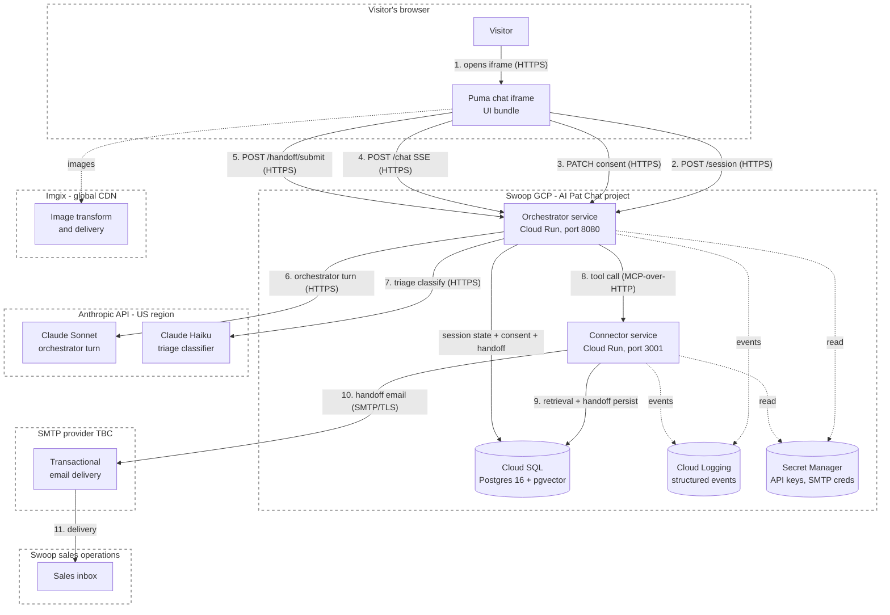

# Data flow

How visitor data moves through Puma at M5 launch. Cross-references `processor-list.md` for each external processor.

---

## Architecture diagram

---

## Trust boundaries

Five boundaries cross externally to Swoop. Each is a TLS connection. Each has a DPA or DPA equivalent.

| # | From | To | Transport | Data | Boundary type |
|---|---|---|---|---|---|
| 1 | Visitor's browser | Swoop GCP (orchestrator) | HTTPS | Visitor messages, consent record, contact details on handoff | Visitor ↔ Swoop |
| 2 | Swoop GCP (orchestrator) | Anthropic API | HTTPS | Visitor messages + conversation history + system prompt for inference | Swoop ↔ Anthropic (cross-border: EU/UK → US) |
| 3 | Swoop GCP (connector) | SMTP provider | SMTP/TLS | Rendered handoff email (contact + conversation summary) | Swoop ↔ SMTP provider |
| 4 | SMTP provider | Swoop sales inbox | SMTP | Same email body | SMTP provider ↔ Swoop |
| 5 | Visitor's browser | Imgix CDN | HTTPS | Image URLs + visitor IP at edge | Visitor ↔ Imgix (no PII volunteered) |

Internal to Swoop GCP (orchestrator ↔ connector ↔ Cloud SQL ↔ Cloud Logging ↔ Secret Manager) is on the GCP private network, IAM-scoped per service account, not a trust boundary in the legal sense. Counsel may still want to confirm the GCP DPA covers all four sub-services.

---

## Flow narrative

The numbered steps below match the diagram.

### 1. Iframe load

Visitor opens Swoop's Patagonia website. They click the Puma trigger button (a Swoop nav element). An iframe loads from Swoop's domain (or a Swoop-controlled subdomain), serving Puma's UI bundle.

No data leaves the browser yet. No session has started. No consent has been captured.

### 2. Session start

Visitor clicks **Continue** on the disclosure / tier-1 consent screen. UI calls `POST /session` to the orchestrator. A session id is issued. Pre-M4 the session lives in orchestrator memory; post-M4 it lives in Cloud SQL.

### 3. Consent record

UI calls `PATCH /session/:id/consent` with the tier-1 consent payload (`{ conversation: true, copyVersion: <hash>, timestamp }`). Orchestrator persists.

If the visitor clicked **No thanks** instead, no session is created, no consent record is written, and the chat closes cleanly.

### 4. Chat turns (the per-message flow)

For each visitor message:

1. UI calls `POST /chat` with `{ sessionId, message }` and opens an SSE stream.
2. Orchestrator runs the **pre-turn triage classifier** (Claude Haiku) — invisible to the visitor, returns a triage stance (qualifying / qualified / referring_out / disqualifying) used for downstream routing. The classifier sees the conversation history but emits no visitor-facing output.
3. Orchestrator runs the **orchestrator turn** (Claude Sonnet) with the system prompt + skills + tools + conversation history.
4. The model may emit tool calls (search, get details, handoff). Each tool call hits the connector via MCP-over-HTTP (in-process pre-M4, separate Cloud Run service post-M4).
5. The connector reads from Cloud SQL (post-M4) — retrieval index, fixtures, structured Patagonia content — and returns results.
6. Orchestrator translates the model's response into SSE message-parts and streams to the UI.

**Reasoning is filtered out of the outbound SSE.** The agent's reasoning blocks are persisted server-side for continuity but never reach the visitor's browser. Documented in `discoveries.md` (2026-04-23 entry).

### 5. Handoff submission

When triage decides the conversation is `qualified` (or `referred_out` with contact-capture), the agent invokes the `handoff` tool, which renders a lead-capture widget in the chat surface. Visitor fills name + email (+ optional phone, time-zone hint), ticks the tier-2 consent checkbox, optionally ticks the marketing opt-in, and submits.

UI calls `POST /handoff/submit` with the full payload. Orchestrator delegates to the connector's `handoff_submit` tool, which:

1. **Validates consent**: rejects unless both `conversationGranted === true` AND `handoffGranted === true` (the `HandoffSubmitConsentGate` backstop in `product/ts-common/src/handoff.ts`).
2. **Writes the durable record** to Cloud SQL (post-M4) — full payload, consent snapshot with `consentCopyVersion`, timestamps, delivery status.
3. **Renders the email** from `product/cms/templates/handoff-email.md` against the payload.
4. **Sends via SMTP** (if `HANDOFF_EMAIL_ENABLED=true`) — qualified always, referred_out per E.2 (lightweight variant), disqualified never.

### 6. Logging

All services emit structured events to Cloud Logging via the `emitEvent` helper in `product/ts-common/src/emit-event.ts`. **Event payloads are PII-free by schema design** — they carry verdicts, reason codes, latencies, error codes, never message bodies or contact details.

Privacy-by-design rationale: even Swoop engineers debugging production cannot see what visitors typed. Conversation contents live only in session state (TTL'd) and in handoff records (consent-gated, retention-policy-bound).

### 7. Cookies + iframe storage

The Puma iframe stores a session id in `sessionStorage` (browser-side, scoped to the iframe origin). No cookies. No `localStorage`. `sessionStorage` clears on tab close.

The parent page (Swoop's website) uses its own cookies + analytics governed by Swoop's existing privacy posture. The iframe does not interact with the parent page's storage. See `open-questions.md` for the question about whether the parent page's cookie banner needs to cover the iframe's `sessionStorage` use.

---

## Data categories — at-a-glance

| Category | Where it lives | Where it leaves Swoop GCP |
|---|---|---|
| Visitor messages (free text; may contain PII) | Cloud SQL (session state, TTL'd) | Anthropic API (per-turn inference) |
| Contact details (name, email, phone) | Cloud SQL (handoff records) | SMTP provider → sales inbox |
| Triage verdict + reason | Cloud SQL (handoff records) + Cloud Logging | None (verdict is internal; no external transmission) |
| Consent flags + copy version | Cloud SQL (session state + handoff records) | None |
| Session metadata (id, timestamps, turn count) | Cloud SQL + Cloud Logging | None |
| Image URLs displayed in widgets | Browser only | Imgix (URL only, no visitor PII volunteered) |
| Reasoning / private thinking | Cloud SQL (session state, TTL'd) | Anthropic API (round-trip; not exposed to visitor) |
| Logs / events | Cloud Logging | None — schema is PII-free |
